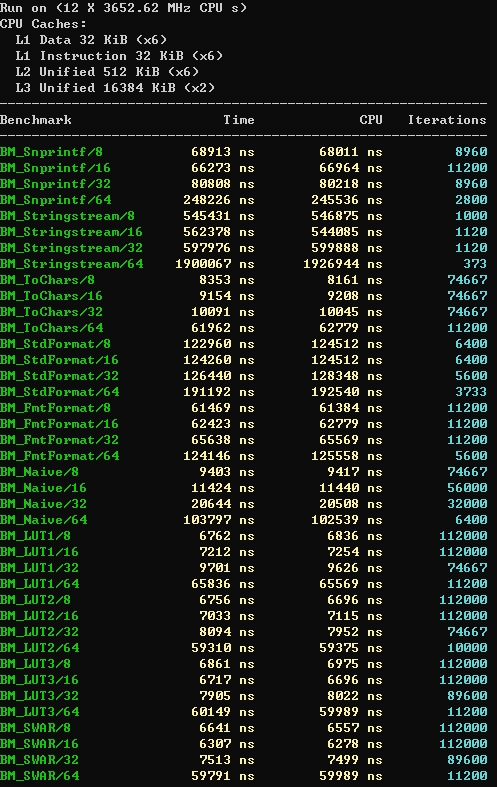
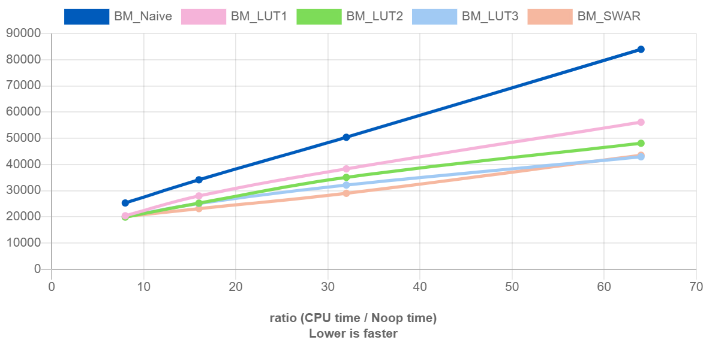
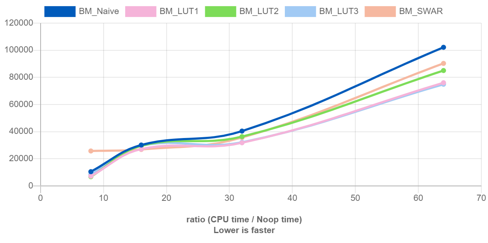

# hex

Performance comparison of dec-to-hex implementations

- C++11
  - `std::snprintf`
  - `std::stringstream` with `std::hex`
  - `fmt::format`
- C++17
  - `std::to_chars`
- C++20
  - `std::format`
- Custom hex functions using lookup table

## Build

```sh
# Use a workflow preset to configure/build/test at once
cmake --workflow --preset windows
```

## Benchmark Results

### MSVC



### Clang

[Quick-bench](https://quick-bench.com/q/DPYQSsyR6-rW36621SEcjdKUqSE)


### GCC

[Quick-bench](https://quick-bench.com/q/QjM2hP1i0i6RaGuzs8Mlua0rgB8)

